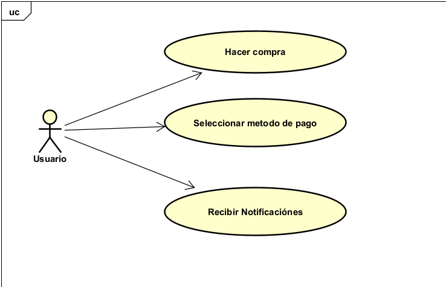

# Parcial-Corte-1-CVDS-DOSW

## NOMBRE: Juan Camilo Cristancho Velasquez

# ECI PAYMENTS

## Descripcion General

Eci Payment es una api parte de una tienda virtual que implementa sistemas de pago con distintos metodos el cual deba ser flexible y extensible para mas metodos y funcionalidades

### Caracteristicas principales

- La api tiene distintos metodos de pago y debe ser extensible para mas
- Cada metodo de pago tiene su propio proceso de validacion y forma de ejecucion 
- El sistema debe poder crear su propio sistema de pago y validador correspondiente

### Sistema de notificaciones

Cuando un pago se ejecuta debidamente, genera notificaciónes a otros modulos de la tiena virtual como:

- El módulo de inventario debe descontar el producto.
- El módulo de facturación debe generar la factura.
- El módulo de notificaciones debe enviar un correo al cliente.

# SOLUCION DEL PARCIAL

### 1. Diagrama de Contexto 

Dentro de la carpeta /docs/uml encontratemos un astah en el que estaran los diagramas de la api

explicacion: El servicio principal sera el ECI PAYMENT y encontramos dos agentes que interactuan con este
- Usuario que es aquel que realiza un metodo de pago, por lo que su entreada con la api es hacer este proceso, y de este su salida sera la notificación dada por la api acerca de las validaciones.

- Modulos de la tienda: hace referencia a los demas componentes de la tienda que con la imlementacion de la api no debemos modificar, al momento de hacer un proceso de pago, los demas modulos actualizan los cambios en el sistema principal

A continuacion la imagen del diagrama: 

(nombre de la imagen: DiagramaDeContexto.png)

### 2. Diagrama de casos de uso

En este diagrama de casos de uso encontramos un solo actor, ya que es como tal el unico que interactua directamente con la api, este usuario puede hacer una compra en la tienda, poder seleccionar un metodo de pago y recibir notificaciones al momento de realizar la compra. 

Dentro de cada caso de uso estará implementado el "Como quiero para poder" ( lo puedes confirmar en el astah :D )

Caso de uso - Como quiero para poder

Hacer un pago - Como usuario quiero hacer un pago para terminar el proceso de compra en la tienda 

Seleccionar metodo de pago - Como usuario quiero cambiar el metodo de pago para poder ajustar al metodo que necesito para hacer la compra

Recibir notificaciones - Como usuario quiero recibir notificaciones para validar que mi compra fue hecha adecuadamente

### 3. Diagrama de clases

Para el diagrama de clases, tome en cuenta la flexibilidad que mencionaba para la api acerca de los metodos de pago y los modulos

## PATRONES DE DISEÑO

### S: single responsability

Podemos abstraer muchas cosas de una tienda virtual, en la que, cada clase tiene su proposito y no debe interferir en el comportamiento de las demas, el mejor ejemplo de este principio solid es la clase EciPayment, ya que como clase principal es la unica que interactua con el usuario, en esta estaran todos los servicios disponibles sin que el usuario tenga que meterse con las demas clases

### O: Open/Close

Gracias a este principio podemos definir clases absractas de los metodos de pago y modulos, ya que si en algun futuro deban implementar mas no hay que cambiar la logica de los ya implementados tal y como menciona el principio (Abierto para extension cerrado para modificacion)

### 4. PATRONES DE DISEÑO

para la impementacion de nuestra API, tendremos en cuenta los siguientes patrones

Factory
Tipo: Creacional
Usamos el parton factory para implementar varios metodos de pago y que la clase principal pueda alternar entre estas, como un usuario debe poder decidir que metodo de pago usar entonces alternamos varias clases de una superclase

Builder
Tipo Creacional
Para generar las validaciones podemos separar las tareas entre los modulos creados, ya que un modulo genera una unica validacion y para generar la factura unimos estas tres salidas.

